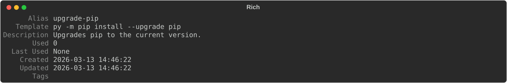

# cmd

The `cmd` command is the core of CmdBox. Use it to add, remove, edit, list, and inspect your saved commands.

The available subcommands for the `cmd` module are:
- [add](#add)
- [get](#get)
- [edit](#edit)
- [list](#list)
- [search](#search)
- [delete](#delete)
- [tag](#tag)
- [untag](#untag)

Some of these subcommands also have aliases available. These will be discussed in the subcommands section.

## `add`

The `add` subcommand adds new commands to your CmdBox database.

When creating a command, you only have to provide the alias you intend to use. You will be prompted for the rest of the 
fields.

```console
> cb cmd add prune-docker

? Enter template: docker system prune -f
? Enter description: Removes all stopped containers.
? Enter tags (comma-separated): dev,docker
```

This same command can be entered in one line.

```console
> cb cmd add prune-docker "docker system prune -f" --description "Removes all stopped containers."
```
Notice in this example that alias and template are provided without a flag. They are not optional fields. Description
is an optional field, so it must be prefaced with a `--description` flag.

You will always be prompted for tags.
> **Hint:** Autocomplete is available for stored tags. In the tag prompt, start typing and the available tags will be
suggested.

If you want to be prompted for every input, you can use the `--interactive` (or `-i`) flag.

```console
> cb cmd add --interactive

? Enter alias: prune-docker
? Enter template: docker system prune -f
? Enter description: Removes all stopped containers.
? Enter tags (comma-separated): dev,docker
```


## `get`
The `get` command is a simple command that retrives a command and displays all of it's available fields along it's tags.

```console
> cb cmd get upgrade-pip
```
> All outputs are stylized. Some of the more stylized outputs will be displayed here in a different format, as shown below:


