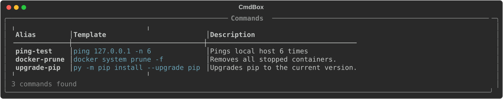
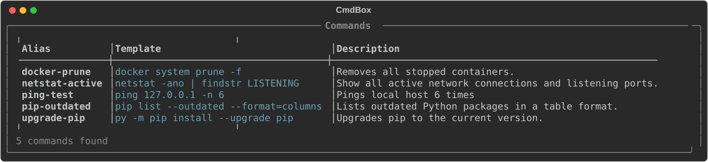
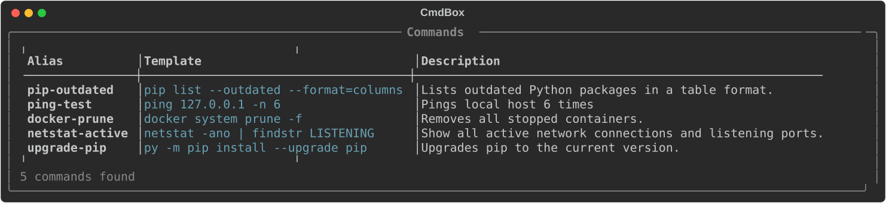
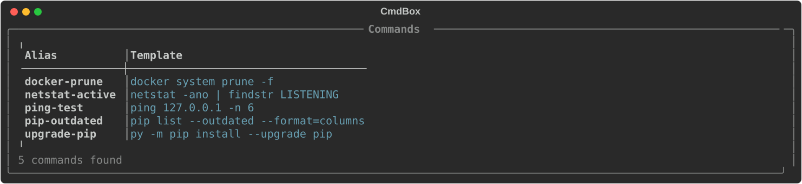
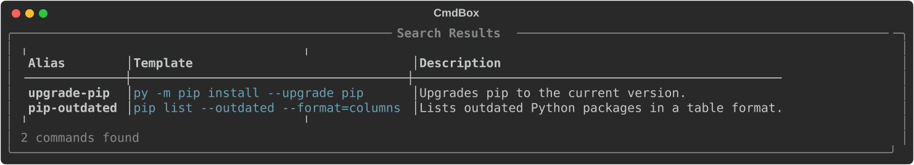
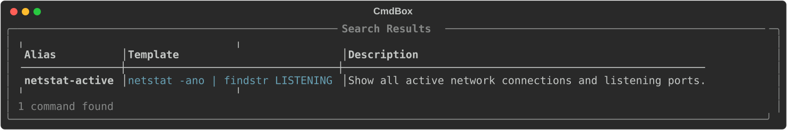
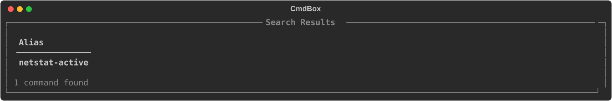

# cmd

The `cmd` command is the core of CmdBox. Use it to add, remove, edit, list, and inspect your saved commands.

The available subcommands for the `cmd` module are:

- [add](#add)
- [get](#get)
- [edit](#edit)
- [list](#list)
- [search](#search)
- [delete](#delete)
- [tag](#tag)
- [untag](#untag)

Some of these subcommands also have aliases available. These will be discussed in the subcommands section.

## `add`

The `add` subcommand adds new commands to your CmdBox database.

When creating a command, you only have to provide an alias. You will be prompted for the rest of the fields.

```console
> cb cmd add prune-docker

? Enter template: docker system prune -f
? Enter description: Removes all stopped containers.
? Enter tags (comma-separated): dev,docker
```

This same command can be entered in one line.

```console
> cb cmd add prune-docker "docker system prune -f" --description "Removes all stopped containers."
```
Notice in this example that alias and template are provided without a flag. They are not optional fields. Description
is an optional field, so it must be prefaced with a `--description` flag.

You will always be prompted for tags.
!!! tip "Autocomplete"
    Autocomplete is available for stored tags. In the tag prompt, start typing and the available tags will be suggested.

If you want to be prompted for every input, you can use the `--interactive` (or `-i`) flag.

```console
> cb cmd add --interactive

? Enter alias: prune-docker
? Enter template: docker system prune -f
? Enter description: Removes all stopped containers.
? Enter tags (comma-separated): dev,docker
```


## `get`
The `get` command is a simple command that retrives a command and displays all of it's available fields along it's tags.

```console
> cb cmd get upgrade-pip
```
!!! note
    All outputs are stylized. Some of the more stylized outputs will be displayed here in a different format, as shown below:




## `update`

!!! tip "Aliases"
    `update` can also be called as `edit`.

The `update` command is used to make changes to a command you already have stored.

You can change only a specific field by specifying that field along with the new value you want it to have.

```console
> cb cmd update prune-docker --template "Removes all stopped containers, dangling images, and unused networks."
```

!!! warning
    Be sure to wrap your values in quotes if they contain spaces.

This updates only the description of the stored `prune-docker` command.

Multiple fields can be updated at once by using the `--set` flag and using key value pairs like: `key=value`.

```console
> cb cmd update prune-docker --set template="docker system prune" description="Removes all stopped containers, asking for confirmation"
```

!!! tip "Autocomplete"
    Autocomplete is available for available fields when using `--set`.

If you want to update the current value of any field, without supplying a completely new value, you can use the `--edit`
(or `-e`) flag. When using `--edit`, you will be prompted to update each field, and the prompt will be pre-filled with the current 
value.

```console
> cb cmd update prune-docker --edit

? Enter alias: prune-docker
? Enter template: docker system prune
? Enter description: Removes all stopped containers, dangling images, and unused networks.
```

If you know you only want to update a specific field, and you don't want to iterate though each field, you can specify
which fields to update by using the `--edit-fields` (or `-ef`) flag.

```console
> cb cmd update prune-docker --edit-fields description

? Enter description: Removes all stopped containers, dangling images, and unused networks.
```

!!! warning
    The `--edit-fields` can only be used in conjunction with the `--edit` flag.


## `list`

!!! tip "Aliases"
    `list` can also be called as `ls`.

The `list` command displays all commands you have stored in your database.

```console
> cb cmd list
```


By default, only the alias, template, and description of each command are displayed, and the default order is by alias.
The default fields and ordering can be adjusted in your settings, or by supplying additonal options to the `list` command.

To change the order, use the `--order` flag and specify the field you want to order by.

```console
> cb cmd list --order description
```



To change the displayed fields, use the `--fields` flag and specify the fields you want to display.

```console
> cb cmd list --field alias --field template
```



If you have a large database of commands, you may only want to list some of them. For this, you can use the `--limit` flag.

```console
> cb cmd list --limit 10
```

List can also be limited to only commands that feature a specific tag.

```console
> cb cmd list --tag dev
```

The `--tag` flag can be used multiple times to list commands that feature multiple tags.

```console
> cb cmd list --tag dev --tag docker --tag production
```

!!! tip
    When using multiple `--tag` flags, commands that feature any of those tags will be displayed.


## `search`

!!! tip "Aliases"
    `search` can also be called as `find`.

While `list` lets you filter your commands by tag, search lets you filter your commands by any of the available fields.
By default, search is limited to the alias and template fields.

```console
> cb cmd search pip
```



Using the `--in` flag, you can limit your search to only the fields you want to search in.

```console
> cb cmd search listening --in description
```



And if you only want to see certain fields in the results output, you can use the `--field` flag.

```console
> cb cmd search listening --in description --field alias
```



As will the list command, you can also limit the number of results returned by using the `--limit` flag.

```console
> cb search pip --limit 3
```

## `delete`

!!! tip "Aliases"
    `delete` can also be called as `rm`, `del`, or `remove`.

The `delete` command is used to remove a command from your database. This is a pretty simple one, it only takes the alias
of the command you want to remove.

```console
> cb delete prune-docker
```

## `tag`

The `tag` command is used to add tags to a command.

To add a tag, supply the command with the alias of the command you want to tag, followed by the name of the tag.

```console
> cb cmd tag pip-outdated dev
```

!!! tip "Autocomplete"
    Autocomplete is available for tags.


## `untag`

Untag works the same as `tag`.

```console
> cb cmd untag pip-outdated dev
```
