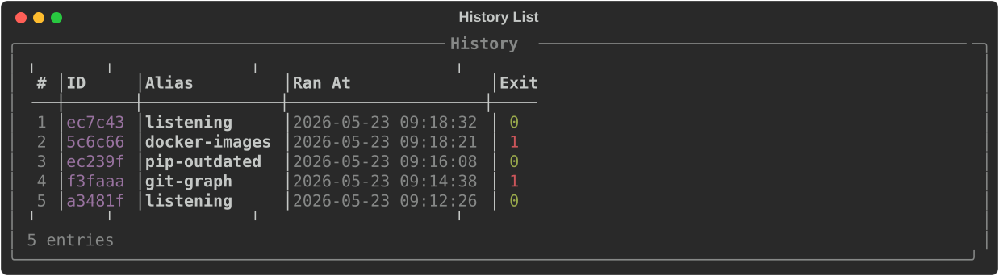
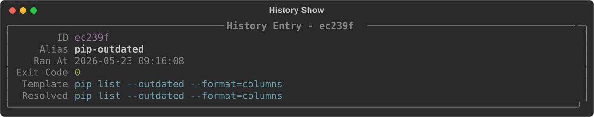

# history

The `history` subcommand lets you view and re-run past command executions. Every time you
run a saved command, CmdBox records it, including which variables were used. This makes it
easy to repeat a previous run exactly as it was, without having to remember or retype
anything.

The available subcommands for `history` are:

- [list](#list)
- [show](#show)
- [rerun](#rerun)
- [last](#last)
- [clear](#clear)

---

## `list`

The `list` subcommand displays your most recent command executions.

```console
> cb history list
```



By default, the 25 most recent entries are shown. Use the `--limit` flag to show more or fewer.

```console
> cb history list --limit 10
```

To see the history for a specific command only, use the `--alias` flag.

```console
> cb history list --alias ping-test
```

Each entry in the list has an index number on the left. This index can be used with
[`show`](#show), [`rerun`](#rerun), and other subcommands to reference a specific entry.

---

## `show`

The `show` subcommand displays the full details of a single history entry, including the
alias, the resolved command, the variables that were used, and when it was run.

Provide either the index number from `history list` or the beginning of the entry's ID.

```console
> cb history show 3
```



---

## `rerun`

The `rerun` subcommand re-executes a past command using the exact same variables it was
originally run with.

```console
> cb history rerun 3
```

This is useful when you need to repeat a command that used a specific set of variable values
without having to supply them again.

!!! tip
    Not sure which entry you want? Run `cb history list` first to find the index, then
    use `cb history show <index>` to confirm it before rerunning.

---

## `last`

The `last` subcommand re-executes the most recent command in your history, using the same
variables it was run with.

```console
> cb history last
```

This is a quick shorthand for the common case of simply repeating the last thing you ran.

!!! tip
    Use the `!!` shortcut to quickly repeat the last ran command.

    ```console
    > cb !!
    ```

---

## `clear`

The `clear` subcommand removes entries from your history.

```console
> cb history clear
```

You will be prompted to confirm before anything is deleted.

To skip the confirmation prompt, use the `--yes` (or `-y`) flag.

```console
> cb history clear --yes
```

To clear the history for a specific command only, use the `--alias` flag.

```console
> cb history clear --alias ping-test
```

The two flags can be combined.

```console
> cb history clear --alias ping-test --yes
```

!!! warning
    Cleared history cannot be recovered.