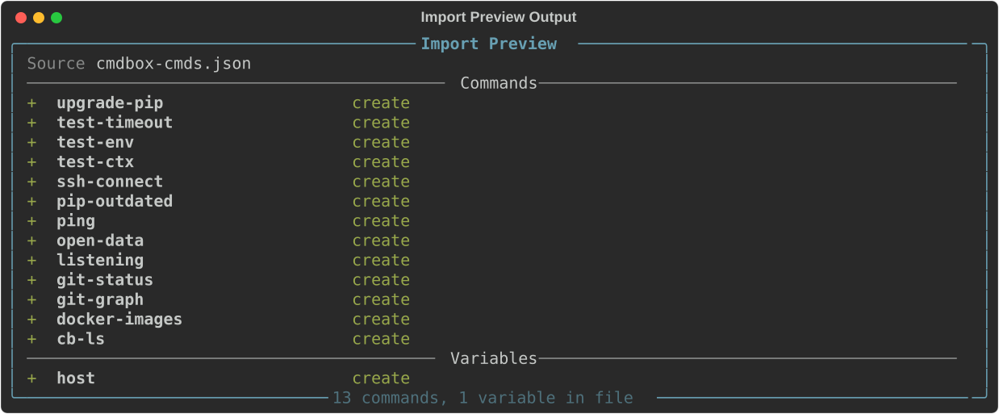

# Import & Export

The `import` and `export` subcommands let you move commands and variables between
machines, share them with teammates, or keep a backup of your CmdBox database. Data is
written to and read from plain JSON files, so exports are easy to inspect, edit by hand,
or commit to a repository.

The available subcommands are:

- [export cmds](#export-cmds)
- [export vars](#export-vars)
- [export all](#export-all)
- [import](#import)

---

## `export`

The `export` command group writes commands and/or variables to a JSON file. There are
three subcommands depending on what you want to export: [`cmds`](#export-cmds),
[`vars`](#export-vars), or [`all`](#export-all).

### Dependencies are included automatically

If a command references another command with `<cmd:name>`, or a variable with
`<var:name>`, that reference won't resolve correctly on the receiving end unless the
referenced item is included too. To prevent broken exports, `export cmds` and
`export vars` always pull in everything a requested item depends on, transitively.

```console
> cb export cmds deploy

Export Complete
  Saved to: ./cmdbox-cmds-2026-06-17.json

  Commands
    deploy
    build-image     (dependency)
    login-ecr       (dependency)

  Variables
    registry-url    (dependency)

2 commands, 1 variable exported
```

Here, requesting `deploy` pulled in `build-image` and `login-ecr` because `deploy`
references them, and `registry-url` because `build-image` references it. Items pulled in
this way are labeled `(dependency)` so it's clear they weren't explicitly requested.

!!! note
    If a command or variable can't be found, it's skipped and a warning is printed.
    The rest of the export still proceeds.

### Output location

By default, the export is saved to the current directory with a generated filename, such
as `cmdbox-cmds-2026-06-17.json`. Use the `--output` (or `-o`) flag to choose a different
location.

```console
> cb export cmds deploy --output ./backups/
```

If the path given to `--output` is an existing directory, the generated filename is placed
inside it. If it's a filename, the export is written there directly.

```console
> cb export cmds deploy --output ./backups/deploy-export.json
```

### `export cmds`

Exports commands to a JSON file. With no arguments, every command in your database is
exported.

```console
> cb export cmds
```

To export specific commands (along with their dependencies), provide their aliases.

```console
> cb export cmds deploy build-image
```

To export commands by tag instead, use the `--tag` flag. This is ignored if any aliases
are also given.

```console
> cb export cmds --tag k8s
```

#### `--flatten`

By default, `<cmd:name>` and `<var:name>` references inside a template are kept as
placeholders in the export, and the referenced items are included separately (as shown
above). The `--flatten` flag instead inlines every reference directly into the
template text, recursively, producing fully self-contained commands with no further
dependencies.

```console
> cb export cmds deploy --flatten
```

!!! tip
    Use the default (non-flattened) export when you want the modular structure of your
    commands preserved on import. Use `--flatten` when you want a single, portable
    command that doesn't depend on anything else existing in the destination database.

### `export vars`

Exports variables to a JSON file. With no arguments, every variable in your database is
exported.

```console
> cb export vars
```

To export specific variables (along with any variables they reference), provide their
names.

```console
> cb export vars aws-region registry-url
```

To export variables by tag instead, use the `--tag` flag. This is ignored if any names
are also given.

```console
> cb export vars --tag aws
```

`--flatten` works the same way as it does for [`export cmds`](#flatten), expanding nested
`<var:name>` references into their final values instead of keeping them as references.

```console
> cb export vars registry-url --flatten
```

!!! warning
    Variable values are included as-is. If any of your variables hold sensitive
    values, such as credentials or access tokens, review the exported file before
    sharing it.

### `export all`

Exports every command and every variable in your database in a single file. This is the
quickest way to take a full backup or move your entire setup to another machine.

```console
> cb export all
```

`--output` and `--flatten` work the same as on the other export subcommands.
`--flatten` applies to both commands and variables.

```console
> cb export all --output ./backups/full-backup.json --flatten
```

---

## `import`

The `import` command reads a JSON export file and adds its contents to your database.

```console
> cb import ./cmdbox-cmds-2026-06-17.json
```

It works with any file produced by `export cmds`, `export vars`, or `export all` — the
importer reads whichever commands and variables are present in the file.

### Conflicts

If an item in the file already exists in your database (matched by alias for commands,
or by name for variables), it's skipped by default and a warning is printed. Nothing
about the existing item is changed.

```console
> cb import ./cmdbox-cmds-2026-06-17.json

Import Complete
  Commands: 1 created, 2 skipped
```

To replace existing items instead, use the `--overwrite` flag.

```console
> cb import ./cmdbox-cmds-2026-06-17.json --overwrite
```

!!! note "Tags"
    Tags referenced by an imported command or variable are created automatically if
    they don't already exist in your database.

### `--preview`

To see what an import would do without making any changes, use the `--preview` flag.

```console
> cb import ./cmdbox-cmds-2026-06-17.json --preview
```



This is useful for checking what's in a file before committing to it, especially when
combined with `--overwrite` to see exactly what would be replaced.

```console
> cb import ./cmdbox-cmds-2026-06-17.json --overwrite --preview
```

### Circular references

If an export file contains a circular reference (for example, a command that depends on
itself through a chain of `<cmd:...>` references), the import is rejected before anything
is written, and the cycle is reported.

```console
> cb import ./broken-export.json

Import rejected — circular reference detected: cmd:a -> cmd:b -> cmd:a
```

!!! tip
    This shouldn't come up under normal use, but it can happen if a file was edited by
    hand. Fix the reference in the file and try the import again.