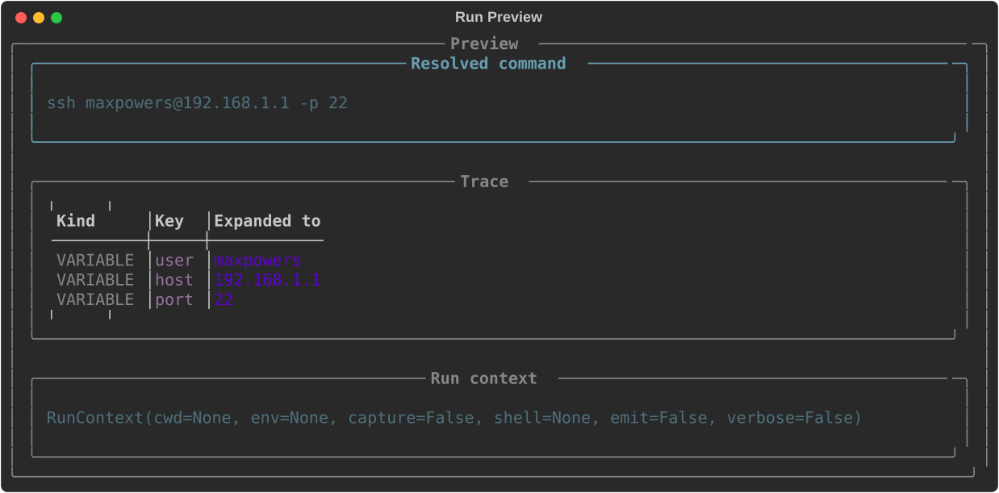

# run

The `run` subcommand executes a saved command by its alias. It also provides options for
controlling how the command runs, such as setting a working directory, passing environment
variables, or previewing what will be executed before committing to running it.

The available subcommands for `run` are:

- [run](#run)
- [preview](#preview)

---

## `run`

Executes the command stored under the provided alias.

```console
> cb run git-graph
```

This is the explicit form. You can also run a saved command directly without the `run` subcommand:

```console
> cb git-graph
```

Both are equivalent. The shorthand form is covered in the [Quick Start](../quickstart.md).

### Supplying variables at runtime

If your command contains variables, supply their values as flags when running.

```console
> cb run ping-test --host google.com
```

Any variable in the command template that is not supplied at runtime and does not have a saved
value will be prompted for before the command executes. See [var](var.md) for information on
saving variable values.

### Options

**`--preview` / `-p`**

Shows the fully resolved command that would be executed, without actually running it. Useful
for verifying that variables have resolved correctly before committing.

```console
> cb run ping-test --host google.com --preview
```

See also: the dedicated [`preview`](#preview) subcommand.
 
---

**`--cwd` / `-d`**

Sets the working directory the command runs in. By default the command runs in your current
directory.

```console
> cb run build --cwd C:\Projects\myapp
```


---

**`--env`**

Sets one or more environment variables for the duration of the command. Can be used multiple
times to set multiple variables.

```console
> cb run build --env NODE_ENV=production --env CI=true
```


---

**`--capture` / `-c`**

Captures the command output instead of printing it directly to the terminal. Useful when
running CmdBox commands inside scripts.

```console
> cb run check-ip --capture
```


---

**`--shell` / `-s`**

Specifies the shell to use when executing the command. By default CmdBox uses your system
shell. Use this option to override it for a specific run.

```console
> cb run my-script --shell powershell
```


---

**`--verbose` / `--no-verbose`**

Outputs additional information alongside the command output. Use `--no-verbose` to
suppress it if verbose output is on by default in your settings.

```console
> cb run build --verbose
```


---

## `preview`

Shows the fully resolved command that would be executed without actually running it. All
variables are resolved and substituted, so you can verify the final command before committing.

```console
> cb preview ssh-connect --user maxpowers --port 22
```



`preview` accepts the same options as `run` — `--cwd`, `--env`, `--shell`, `--capture`, and
`--verbose` — so you can preview the command exactly as it would be run under those conditions.

!!! tip
Use `preview` any time a command contains multiple variables or references other commands
via `<cmd:command-name>` to make sure everything resolves as expected before running.
