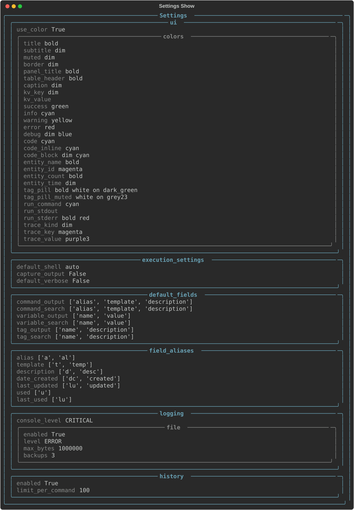

# settings

The `settings` subcommand lets you view and edit your CmdBox configuration. Settings control
default behaviors across the app (things like default display fields, ordering, and limits)
so you don't have to supply the same options every time you run a command.

The available subcommands for `settings` are:

- [show](#show)
- [edit](#edit)

---

## `show`

The `show` subcommand displays your current settings in a table.

```console
> cb settings show
```



To display only specific settings, use the `--fields` flag with a comma-separated list of
field names.

```console
> cb settings show --fields editor,data_file
```

---

## `edit`

The `edit` subcommand opens your settings for editing. By default, settings are edited
interactively in the terminal. The current settings will be displayed with their current values pre-filled.
You can edit them directly in the terminal.

```console
> cb settings edit
```

!!! tip
    When editing settings interactively in the terminal, press `Esc` to exit edit mode without saving changes, or 
    press `Ctrl+S` to save the changes and exit edit mode.

If you prefer to edit the settings file directly, use the `--external` (or `-e`) flag.
This opens the settings file in your default text editor.

```console
> cb settings edit --external
```

!!! warning
    When using `--external`, take care not to change field names or the file structure.
    CmdBox may not start correctly if the settings file is malformed.

---

## `data-dir`

The `data-dir` subcommand opens the directory where CmdBox stores its data in the default file explorer. This is 
intended as a convenience command for users who want quick access to their settings, database, or log files.

```console
> cb settings data-dir
```

You may also provide the `--print` (or `-p`) flag to print this path to the console without opening it.

```console
> cb settings data-dir --print
```

### Data Directory Location

| Platform | Path |
|----------|------|
| Windows | `%APPDATA%\PhantomLamb\CmdBox\settings.toml` |
| macOS | `~/Library/Application Support/PhantomLamb/CmdBox/settings.toml` |
| Linux | `~/.local/share/PhantomLamb/CmdBox/settings.toml` |

---

# Settings Reference

Below is a reference for all available settings in the `settings.toml` file, what they do, and their default values.

---

### `[ui]`

General user interface settings.

#### `use_color`

**Default:** `true`

Controls whether CmdBox uses colors and styles in terminal output. Set to `false` to disable all
styling, which can be useful in environments that do not support ANSI color codes or when piping
output to other tools.
 
---

### `[ui.colors]`

Controls the colors and text styles used throughout CmdBox's output. Each key corresponds to a
specific UI element. Values are [Rich style strings](https://rich.readthedocs.io/en/stable/style.html),
which support colors, boldness, italics, and other text attributes.

!!! tip
    You do not need to define every key. You only need to change the values you want to customize.
    Leave any entry as an empty string (`""`) to use your terminal's default text style.

The following table lists all available color keys, their default values, and where each style
is applied.

| Key | Default | Applied To |
|-----|---------|------------|
| `title` | `"bold"` | Page and section titles |
| `subtitle` | `"dim"` | Subtitles beneath titles |
| `muted` | `"dim"` | De-emphasized or secondary text |
| `border` | `"dim"` | Table and panel borders |
| `panel_title` | `"bold"` | Titles inside panels |
| `table_header` | `"bold"` | Column headers in tables |
| `caption` | `"dim"` | Captions beneath tables or panels |
| `kv_key` | `"dim"` | Keys in key-value displays |
| `kv_value` | `""` | Values in key-value displays |
| `success` | `"green"` | Success messages |
| `info` | `"cyan"` | Informational messages |
| `warning` | `"yellow"` | Warning messages |
| `error` | `"red"` | Error messages |
| `debug` | `"dim blue"` | Debug messages |
| `code` | `"cyan"` | General code text |
| `code_inline` | `"cyan"` | Inline code within prose |
| `code_block` | `"dim cyan"` | Multi-line code blocks |
| `entity_name` | `"bold"` | Names of commands, variables, and tags |
| `entity_id` | `"magenta"` | IDs of commands, variables, and tags |
| `entity_count` | `"bold"` | Count values (e.g., number of results) |
| `entity_time` | `"dim"` | Timestamps and dates |
| `tag_pill` | `"bold white on dark_green"` | Tag labels in normal contexts |
| `tag_pill_muted` | `"white on grey23"` | Tag labels in de-emphasized contexts |
| `run_command` | `"cyan"` | The command shown before execution output |
| `run_stdout` | `""` | Standard output from executed commands |
| `run_stderr` | `"bold red"` | Standard error from executed commands |
| `trace_kind` | `"dim"` | The kind label in trace output |
| `trace_key` | `"magenta"` | Keys in trace output |
| `trace_value` | `"purple3"` | Values in trace output |

 
---

### `[execution_settings]`

Controls how CmdBox executes commands. Each setting acts as the default value for the
corresponding CLI flag on `cb cmd run`, and can always be overridden at runtime.

#### `default_shell`

**Default:** `"auto"`

The shell used to execute commands. When set to `"auto"`, CmdBox detects the appropriate shell
for your platform (`cmd.exe` on Windows, the user's default shell on macOS and Linux). Set this
to a specific shell (e.g., `"bash"`, `"zsh"`, `"powershell"`) to override the detected value.
Can be overridden at runtime with the `--shell` flag.

#### `capture_output`

**Default:** `false`

The default value for the `--capture` flag on `cb cmd run`. When `true`, command output is
captured and returned rather than printed directly to the terminal. Useful when running CmdBox
inside scripts. Can be overridden at runtime with `--capture` or `--no-capture`.

#### `default_verbose`

**Default:** `false`

The default value for the `--verbose` flag on `cb cmd run`. When `true`, CmdBox prints additional
details during command execution. Can be overridden at runtime with `--verbose` or `--no-verbose`.
 
---

### `[default_fields]`

Controls which fields are shown by default in output and search results. Each key accepts a list
of field names. Any field available on the underlying model can be included — these are just the
defaults. You can always request specific fields at runtime using the `--fields` flag.

| Key | Default Fields |
|-----|---------------|
| `command_output` | `alias`, `template`, `description` |
| `command_search` | `alias`, `template`, `description` |
| `variable_output` | `name`, `value` |
| `variable_search` | `name`, `value` |
| `tag_output` | `name`, `description` |
| `tag_search` | `name`, `description` |

 
---

### `[field_aliases]`

#### `[field_aliases.alias_mapping]`

Maps full field names to shorthand aliases you can use with the `--fields` flag. This lets you
type `--fields a,d` instead of `--fields alias,description`, for example. CmdBox ships with
sensible defaults, but you can add or change any mapping to match your preferred shorthand.

| Field | Default Aliases |
|-------|----------------|
| `alias` | `a`, `al` |
| `template` | `t`, `temp` |
| `description` | `d`, `desc` |
| `date_created` | `dc`, `created` |
| `last_updated` | `lu`, `updated` |
| `used` | `u` |
| `last_used` | `luse` |

To add your own alias, add an entry under `[field_aliases.alias_mapping]`:

```toml
[field_aliases.alias_mapping]
template = ["t", "temp", "tmpl"]  # add as many aliases as you like
```

 
---

### `[logging]`

#### `console_level`

**Default:** `"CRITICAL"`

The minimum log level printed to the terminal. Defaults to `"CRITICAL"` so that internal log
messages do not clutter command output during normal use. Set to a lower level if you need to
inspect CmdBox's internal behavior.

Accepted values (from least to most verbose): `"CRITICAL"`, `"ERROR"`, `"WARNING"`, `"INFO"`, `"DEBUG"`

#### `[logging.file]`

Controls log file output. Log files are written to the same application data directory as the
settings file.

| Key | Default | Description |
|-----|---------|-------------|
| `enabled` | `true` | Whether log file output is active |
| `level` | `"ERROR"` | Minimum log level written to the file |
| `max_bytes` | `1000000` | Maximum log file size before rotation. Accepts a raw byte count or a human-readable string such as `"1mb"` or `"500kb"`. |
| `backups` | `3` | Number of rotated log files to keep |

